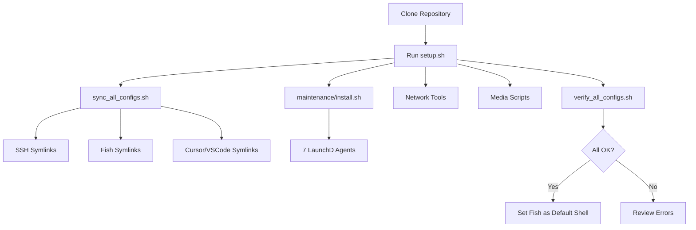

# Post-Reset macOS Restoration Plan

This plan leverages your existing `[setup.sh](setup.sh)` bootstrap infrastructure while adding Zsh comparison logic and a structured approach for post-reset recovery.

---

## Phase 1: Audit and Diff Strategy

### 1.1 Pre-Flight Checks (Read-Only)

Before any changes, audit the divergence between local system and repository:

```bash
# Clone/verify repo is at expected location
cd ~/Documents/dev
git clone https://github.com/abhimehro/personal-config.git  # or pull if exists

# Compare Fish config (repo vs local if not symlinked yet)
diff -u ~/Documents/dev/personal-config/configs/.config/fish/config.fish \
       ~/.config/fish/config.fish 2>/dev/null || echo "No local Fish config yet"

# Compare Zsh config (new local vs any repo backup)
diff -u ~/Documents/dev/personal-config/configs/.zshrc \
       ~/.zshrc 2>/dev/null || echo "No .zshrc in repo yet - local is source of truth"
```

### 1.2 Zsh Enhancement Extraction

Extract portable improvements from your new `~/.zshrc` to port into Fish:

```bash
# Identify Homebrew/Python-specific blocks in Zsh
grep -E '(brew|python|conda|pyenv|PATH)' ~/.zshrc > /tmp/zsh-enhancements.txt

# Review for Fish porting candidates
cat /tmp/zsh-enhancements.txt
```

**Key patterns to port:**


| Zsh Pattern               | Fish Equivalent                        |
| ------------------------- | -------------------------------------- |
| `export PATH="..."`       | `fish_add_path --global --prepend ...` |
| `eval "$(brew shellenv)"` | Already in repo's `config.fish`        |
| `source ~/.zshrc`         | `source ~/.config/fish/config.fish`    |
| `alias foo='bar'`         | `alias foo='bar'` (same syntax)        |


---

## Phase 2: Master Restoration Script

Your existing `[setup.sh](setup.sh)` handles most orchestration. The restoration flow:




### 2.1 Execute Bootstrap

```bash
cd ~/Documents/dev/personal-config
./setup.sh
```

This runs:

1. `[scripts/sync_all_configs.sh](scripts/sync_all_configs.sh)` - Creates symlinks with backup-before-overwrite
2. `[maintenance/install.sh](maintenance/install.sh)` - Installs 7 LaunchD agents to `~/Library/LaunchAgents/`
3. Network tools, rclone config, and media scripts

### 2.2 Set Fish as Default Shell

```bash
# Add Fish to allowed shells (if not present)
grep -q /opt/homebrew/bin/fish /etc/shells || \
  echo /opt/homebrew/bin/fish | sudo tee -a /etc/shells

# Set Fish as default
chsh -s /opt/homebrew/bin/fish

# Install Fisher + plugins
./scripts/bootstrap_fish_plugins.sh
```

### 2.3 Zsh Config Integration (New Script)

Create a new script to optionally track the local Zsh config:

**Proposed**: `scripts/sync_zsh_config.sh`

- Backs up existing repo `.zshrc` (if any)
- Copies `~/.zshrc` to `configs/.zshrc`
- Creates symlink `~/.zshrc` -> `configs/.zshrc`
- Extracts portable enhancements for Fish review

### 2.4 Port Zsh Enhancements to Fish

After reviewing `/tmp/zsh-enhancements.txt`, add useful patterns to `[configs/.config/fish/config.fish](configs/.config/fish/config.fish)`:

```fish
# Example: If Zsh has pyenv setup, add to Fish:
if type -q pyenv
    pyenv init - | source
end
```

---

## Phase 3: Backup and Maintenance Protocol

### 3.1 ProtonDrive Integration

Your branch already includes ProtonDrive backup. After merge:

```bash
# Verify ProtonDrive is mounted
ls ~/Library/CloudStorage/ProtonDrive-*

# Test backup (dry-run)
./scripts/protondrive_backup.sh --dry-run --no-delete

# Verify LaunchD agent
launchctl list | grep protondrivebackup
```

### 3.2 Git Workflow for Dependabot PRs

```bash
# Fetch all branches including Dependabot PRs
git fetch origin

# List open PRs/branches
git branch -r | grep dependabot

# Review and merge (example)
git checkout main
git merge origin/dependabot/npm_and_yarn/... --no-edit
git push origin main
```

**Recommended workflow:**

1. Review Dependabot PR on GitHub web UI
2. If tests pass (or manual verification), merge via GitHub
3. Pull locally: `git pull origin main`

### 3.3 Committing Local Improvements

After porting Zsh enhancements to Fish:

```bash
cd ~/Documents/dev/personal-config
git add configs/.config/fish/config.fish configs/.zshrc
git commit -m "feat: port Zsh enhancements to Fish config"
git push origin main
```

---

## Phase 4: Manual Intervention List

These actions cannot be automated and require GUI or sensitive input:


| Action              | Reason            | Instructions                                                                         |
| ------------------- | ----------------- | ------------------------------------------------------------------------------------ |
| 1Password unlock    | Auth required     | Open 1Password, authenticate with biometrics                                         |
| 1Password SSH agent | GUI toggle        | Settings > Developer > SSH Agent > Enable                                            |
| ProtonDrive login   | OAuth flow        | Open ProtonDrive app, sign in                                                        |
| Homebrew install    | Interactive       | `/bin/bash -c "$(curl -fsSL ...)"`                                                   |
| GitHub SSH key      | 1Password managed | Verify `ssh -T git@github.com` works                                                 |
| Control D service   | Sudo required     | `sudo ctrld service start --config ~/.config/controld/ctrld.toml --skip_self_checks` |
| Windscribe login    | GUI app           | Open Windscribe, authenticate                                                        |
| rclone credentials  | 1Password inject  | `op inject -i ~/.config/rclone/rclone.conf.template -o ~/.config/rclone/rclone.conf` |
| Cursor CLI          | GUI action        | Cmd+Shift+P > "Shell Command: Install 'cursor' command"                              |
| Full Disk Access    | System Prefs      | Grant to Terminal/Warp for backup scripts                                            |


---

## Execution Checklist

```
[ ] Prerequisites installed (brew, op, fish, terminal-notifier)
[ ] Repository cloned to ~/Documents/dev/personal-config
[ ] Run ./setup.sh (idempotent)
[ ] Set Fish as default shell (chsh)
[ ] Install Fisher plugins (./scripts/bootstrap_fish_plugins.sh)
[ ] Compare/merge Zsh config
[ ] Port Zsh enhancements to Fish
[ ] Verify LaunchD agents (launchctl list | grep maintenance)
[ ] Test ProtonDrive backup (--dry-run)
[ ] Complete manual interventions (1Password, etc.)
[ ] Merge pending Dependabot PRs
[ ] Commit local improvements
```

---

## Files to Create/Modify


| File                               | Action | Purpose                            |
| ---------------------------------- | ------ | ---------------------------------- |
| `scripts/sync_zsh_config.sh`       | Create | Track Zsh config with backup logic |
| `scripts/compare_shell_configs.sh` | Create | Audit tool for Fish/Zsh/Bash diff  |
| `configs/.zshrc`                   | Create | Store Zsh config in repo           |
| `configs/.config/fish/config.fish` | Modify | Port Zsh enhancements              |
| `docs/POST_RESET_GUIDE.md`         | Create | Document this restoration process  |


