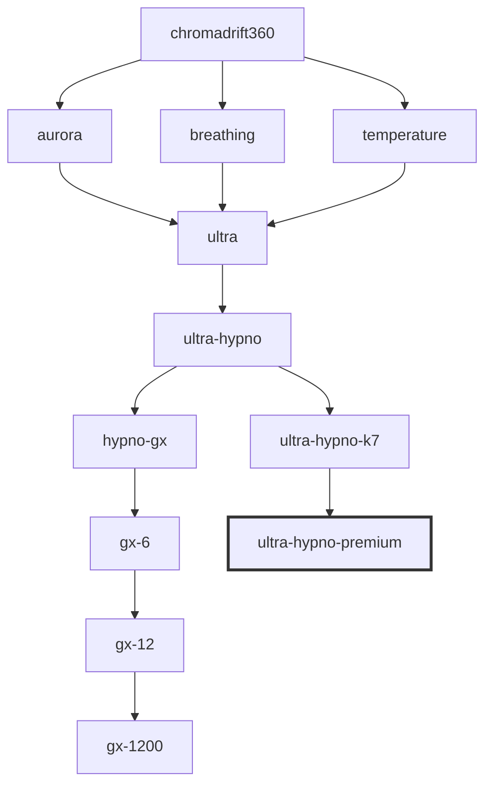

```
                                                     
        )                      (          (       )  
     ( /( (          )      )  )\ ) (  (  )\ ) ( /(  
  (  )\()))(   (    (    ( /( (()/( )( )\(()/( )\()) 
  )\((_)\(()\  )\   )\  ')(_)) ((_)|()((_)/(_)|_))/  
 ((_) |(_)((_)((_)_((_))((_)_  _| | ((_|_|_) _| |_   
/ _|| ' \| '_/ _ \ '  \() _` / _` || '_| ||  _|  _|  
\__||_||_|_| \___/_|_|_|\__,_\__,_||_| |_||_|  \__|  
                                                     
```

**a digital lifestyle entanglement system for [ghostty](https://ghostty.org) terminal.**

chromadrift transmits a vibe system through the hypnodynamics of color variations between rectangles. it understands noise, gradient, dithering, and banding. it seeks to create something cool, present, and premium.

<video src="https://github.com/user-attachments/assets/4ea0a5fa-e81d-4b56-878a-a6f91aeed98f" autoplay loop muted playsinline></video>

## getting started

if you've never used ghostty shaders before, don't worry. this guide will walk you through everything step by step.

### what you need

before we begin, make sure you have:

1. **ghostty terminal installed** - download from [ghostty.org](https://ghostty.org)
2. **a text editor** - any editor works (textedit, vs code, nano, etc.)
3. **terminal access** - you'll copy some files and edit a config

### step 1: create the shaders folder

ghostty looks for shaders in a specific folder. let's create it.

open your terminal and run:

```bash
mkdir -p ~/.config/ghostty/shaders
```

this creates the folder where ghostty expects to find shader files. the `-p` flag means "create parent folders if they don't exist."

### step 2: download the shader

```bash
git clone https://github.com/mfelix/chromadrift.git ~/.config/ghostty/shaders/chromadrift
```

that's it. one command. the shaders are now in place.

### step 3: configure ghostty

ghostty's config file lives at `~/.config/ghostty/config`. if it doesn't exist, create it.

add these lines to your config:

```bash
# chromadrift shader
custom-shader = ~/.config/ghostty/shaders/chromadrift/chromadrift360-ultra-hypno-premium.glsl
custom-shader-animation = always
```

**important**: the `custom-shader-animation = always` line is required. without it, the shader won't animate and you'll just see a static gradient.

### step 4: restart ghostty

close and reopen ghostty. you should see the chromadrift gradient flowing behind your terminal text.

### hot-reloading shaders

ghostty supports hot-reloading custom shaders, allowing for real-time updates without restarting the application. simply save changes to your `.glsl` shader file; ghostty's renderer generally updates to reflect modifications instantly.

if changes do not appear, use the default configuration reload shortcut:
- **macOS**: `Cmd+Shift+,`
- **Linux**: `Ctrl+Shift+R`

---

## the chromadrift system

```
┌─────────────────────────────────────────────────────────────────────────────┐
│                                                                             │
│    ░░░░░░░░░░░░░░░░░▒▒▒▒▒▒▒▒▒▒▒▒▒▒▒▒▓▓▓▓▓▓▓▓▓▓▓▓▓▓▓▓████████████████████    │
│                                                                             │
│    GRADIENT          ROTATION           AURORA            BREATHING         │
│    ────────          ────────           ──────            ─────────         │
│    colors flow       360° sweep         rippling          luminance         │
│    between           per minute         edges             pulse             │
│    rectangles                           8 sec cycle                         │
│                                                                             │
│    TEMPERATURE       DITHERING          PIXELATION                          │
│    ───────────       ─────────          ───────────                         │
│    cool ↔ warm       Bayer matrix       glass square                        │
│    5 min cycle       noise layers       micro-grid                          │
│                                                                             │
└─────────────────────────────────────────────────────────────────────────────┘
```

---

## mutations

all other variants live in the `mutations/` folder. these are the evolutionary steps that led to the premium.

### foundation layer

| shader | description |
|--------|-------------|
| `mutations/chromadrift360.glsl` | **the origin.** 360° rotating gradient with noise dithering. one full rotation per minute. the foundation of all that follows. |

### feature variants

| shader | what it adds |
|--------|--------------|
| `mutations/chromadrift360-aurora.glsl` | **aurora wisps.** gentle sine-wave undulations along the gradient edge. the boundary ripples like northern lights. |
| `mutations/chromadrift360-breathing.glsl` | **breathing luminance.** 8-second brightness cycle. the screen gently inhales and exhales. 15% luminance variation. |
| `mutations/chromadrift360-temperature.glsl` | **temperature drift.** palette shifts from cool (blues, teals, purples) to warm (reds, oranges, magentas) over 5 minutes. glacial mood transition. |

### combined variants

| shader | features combined |
|--------|-------------------|
| `mutations/chromadrift360-ultra.glsl` | **the unification.** aurora + breathing + temperature. all three feature layers merged. |
| `mutations/chromadrift360-ultra-hypno.glsl` | **hypno mode.** ultra + 4-layer dithering system: fbm clouds, fine grain, bayer matrix, moving texture. present and animated. |
| `mutations/chromadrift360-ultra-hypno-k7.glsl` | **k7 refinement.** reduced hypno intensity. expanded texture scale. 8x8 bayer dithering. 2px micro-grid alignment. the intensity, refined. |

### gx series (pixelation experiments)

| shader | pixel size | character |
|--------|------------|-----------|
| `mutations/chromadrift360-hypno-gx.glsl` | 3px | subtle 8-bit texture |
| `mutations/chromadrift360-hypno-gx-6.glsl` | 6px | visible pixel grid |
| `mutations/chromadrift360-hypno-gx-12.glsl` | 12px | chunky retro blocks |
| `mutations/chromadrift360-hypno-gx-1200.glsl` | 1200px | massive color fields |

---

## evolution tree



---

## technical specifications

### timing cycles

| system | duration | purpose |
|--------|----------|---------|
| gradient rotation | 60 seconds | full 360° sweep |
| color cycling | ~63 seconds | color interpolation phase |
| breathing | 8 seconds | luminance pulse |
| temperature drift | 5 minutes | cool/warm palette shift |

### dithering layers (premium)

| layer | scale | intensity | movement |
|-------|-------|-----------|----------|
| organic fbm | 0.003 | 0.010 | slow drift |
| bayer 8x8 | 1:1 | 0.018 | static pattern |
| hypno wave | 0.005 | 0.008 | whisper motion |

### color palettes

**cool spectrum:**
```
┌────────────┬────────────┬────────────┐
│ deep blue  │   teal     │  purple    │
│ 0.08 0.12  │ 0.10 0.35  │ 0.25 0.10  │
│     0.45   │     0.40   │     0.45   │
└────────────┴────────────┴────────────┘
```

**warm spectrum:**
```
┌────────────┬────────────┬────────────┐
│ deep red   │  orange    │  magenta   │
│ 0.50 0.10  │ 0.50 0.25  │ 0.45 0.10  │
│     0.15   │     0.08   │     0.35   │
└────────────┴────────────┴────────────┘
```

---

## obstacle mitigation

### the shader isn't showing

1. **check the file path** - make sure the shader file exists at the path you specified
2. **check `custom-shader-animation`** - this must be set to `always` for animated shaders
3. **restart ghostty** - config changes require a restart
4. **check for typos** - the config file is case-sensitive

### the animation is choppy

1. try a simpler variant like `chromadrift360.glsl` (less gpu intensive)
2. close other gpu-heavy applications
3. the gx variants with larger pixel sizes (6, 12, 1200) are lighter on resources

---

## reqs

- [ghostty](https://ghostty.org) terminal emulator
- a display capable of showing rectangles
- appreciation for slow, intentional color motion

---

## license

mit. drift freely.

---

## creds

chromadrift began with [`animated-gradient-shader.glsl`](https://github.com/0xhckr/ghostty-shaders) by [0xhckr](https://github.com/0xhckr).
ascii art generated with [taag](https://patorjk.com/software/taag/) by patrick gillespie.

think, make, feel
keep it real

---

```
                    -.-. .... .-. --- -- .- -.. .-. .. ..-. -

                              ░░░░░░░░░░░░░░░░
                            ░░                ░░
                          ░░    one love        ░░
                          ░░                    ░░
                          ░░    be free         ░░
                            ░░                ░░
                              ░░░░░░░░░░░░░░░░
```
